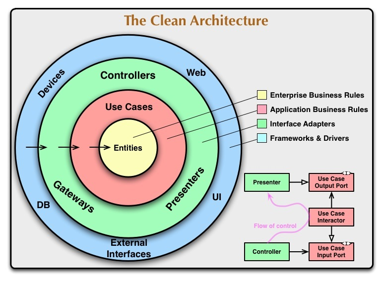
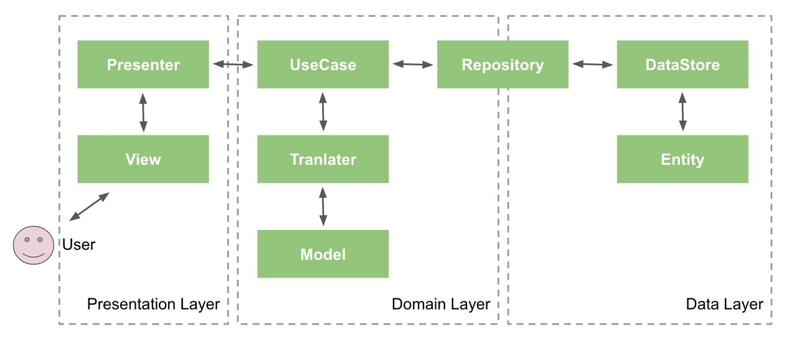

### 1. 일반적인 Clean-Architecture의 개념 설명을 위한 계층도
   

### 2. Android에서의 Clean-Architecture 개념 설명을 위한 계층도
      

### 3. Clean-Architecture란 무엇인가
  - 계층을 크게 나누어서 관심사를 분리하고, 분리된 각 클래스가 한가지 역할만 할 수 있도록 구현하는 방식  
    : 관심사를 분리하여 각 Layer의 관심사를 분리하고 계층 내부로 들어갈 수록 의존성이 낮아지도록 개발하는것이 관건이다.

### 4. 기본적인 Clean-Architecture 구현
#### 1) 일반적으로 Presentation Layer, Domain Layer, Data Layer의 세 가지 레이어로 구분된다.  
##### 각 레이어의 정의는 아래와 같다.  
- Presentation Layer  
  : View에 관련된 Layer로 View와 View를 Control하는 ViewModel이 정의된다.
- Domain Layer  
  : View에 구현된 기능의 Business Logic이 정의되며, View에서 사용되는 Model이 함께 정의된다.
- Data Layer  
  : 통신과 관련된 기능들이 정의되며, Domain에 정의된 Model을 Data에 정의된 Model과 Mapping 하는 Mapper가 함께 정의된다.

#### 2) Layer간 Dependency
- Presentation Layer  
  : Dependency Injection을 위하여 Domain, Data Layer를 모두 참조한다.
- Domain Layer  
  : 다른 Layer가 변경되었을 때에도 Business Logic은 변하면 안되기 때문에 아무런 Layer를 참조하지 않는다.  
  : 순수 Kotlin 코드로만 사용하는것이 기본이나, 필요에 따라 android library로 사용하기도 한다.
- Data Layer  
  : Repository-Pattern의 DIP(의존성 역전의 법칙)를 적용하여 Domain Layer를 참조한다.

#### 3) Clean-Architecture 구현 시 함께 적용하는 개념 및 Library
- Multi-Module  
  : 각각의 Layer를 Module 단위로 분리하여 사용
- Repository-Pattern  
  : Data Layer와 Domain Layer의 관심사를 분리하며 일관된 루트로 데이터를 제공

### 5. Clean-Architecture의 장점
#### 1) 유지보수가 쉬움
- 관심사가 명확히 분리되어 있기 때문
#### 2) 재사용성이 좋음
- Business Logic의 의존성이 분리되어 있기 때문
#### 3) 테스트가 용이함
- 의존관계가 최소화 되어있기 때문에 모듈단위의 테스트가 용이
